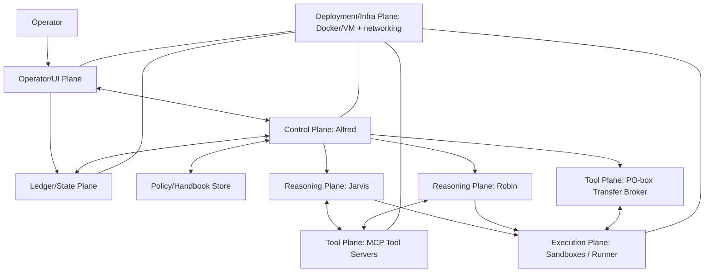
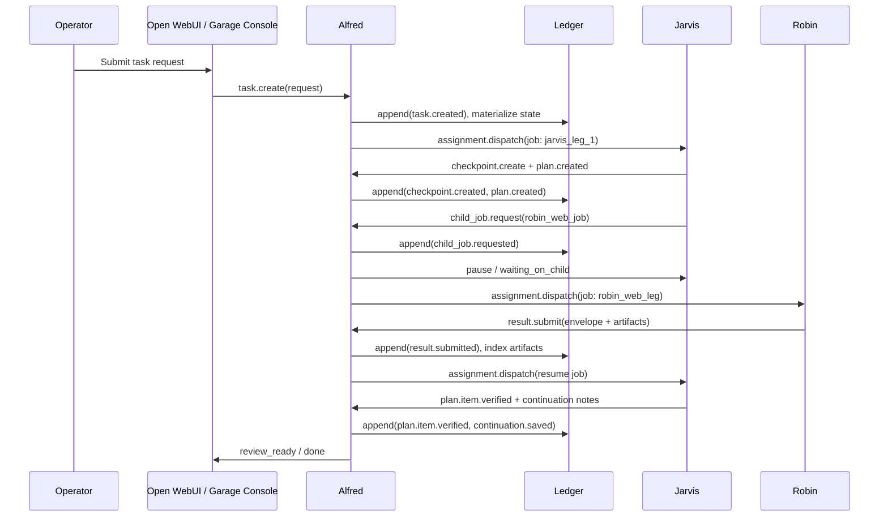

# AI Garage Target-State Architecture Research

## Executive Conclusion

**1. Executive Conclusion**

The strongest practical final architecture direction for **AI Garage** is a **local-first “durable execution workbench”** built around **strict role separation** (Jarvis / Robin / Alfred) and an **explicit, durable Ledger** that is the *only* system of record for job progression, handoffs, artifacts, and continuation. The architecture should behave like a *managed machine for long-running work*, not like a chat session with vibes. fileciteturn103file0L1-L1

Concretely, the recommended end-state is:

- **Operator front-end**: entity["organization","Open WebUI","open-source ai chat ui"] as the “front desk” plus a dedicated “Garage Console” view that reads from Alfred/Ledger (UI is not authoritative). fileciteturn103file0L1-L1  
- **Reasoning workers**:  
  - **Jarvis**: the main reasoning / planning / coding role, operating in a controlled workbench (initially entity["organization","OpenHands","ai agent workspace"]) that provides a real workspace/terminal/editor surface inside the garage boundary. fileciteturn103file0L1-L1  
  - **Robin**: the browser/web/visual role, implemented via entity["organization","Stagehand","browser automation library"] + Playwright-like automation, returning structured results + evidence. fileciteturn103file0L1-L1  
- **Control plane**: **Alfred** as a deterministic orchestration service (not an AI) that owns job lifecycle, handoffs, policy enforcement, checkpointing, and all “official” records. fileciteturn103file0L1-L1  
- **Ledger plane**: a layered durable record system: **SQLite for mutable state + JSONL append-only event log + artifact store + structured memory summaries** (and policy/handbook versioning). fileciteturn103file0L1-L1 fileciteturn104file0L1-L1  
- **Tool plane**: standardized tool servers via MCP (Streamable HTTP or stdio), with strict boundaries and evidence capture. citeturn0search2  
- **Execution plane**: sandboxed execution (Docker-first now, VM boundary later) and narrow brokered import/export via the “PO box” transfer lane. fileciteturn103file0L1-L1  

The single strongest direction: **AI Garage should be architected as a local durable-execution system whose “truth” is an event log + indexed state (Ledger), controlled by deterministic orchestration (Alfred), and executed by specialized workers (Jarvis/Robin) via standardized tools.** fileciteturn103file0L1-L1 fileciteturn104file0L1-L1

**Explicit separation required by the project:**

- **FINAL TARGET-STATE AI GARAGE ARCHITECTURE**: role-separated durable execution system described above. fileciteturn103file0L1-L1  
- **CURRENT STABILIZED OH_SHOP BASELINE**: a proven local stack (LM Studio + OpenHands + Open WebUI + stagehand-mcp) that demonstrates feasibility but is not the final architecture. fileciteturn116file0L1-L1 fileciteturn121file0L1-L1  
- **HISTORICAL / NON-AUTHORITATIVE MATERIAL**: earlier setup/mission docs that may contain still-valuable constraints but do not override the Blueprint and Library/Policy contract. fileciteturn123file0L1-L1  

## Why the First Research Pass Was Not Enough

**2. Why the First Research Pass Was Not Enough**

The first deep research pass (the uploaded report) correctly established **current-state runtime truth**: what OH_SHOP actually runs, what was proven end‑to‑end, and where the operational hazards and drift are. fileciteturn96file0L1-L1

But that pass was structurally insufficient for this question because **AI Garage is not “OH_SHOP cleaned up.”** The Blueprint and Library/Policy contract define a **target system with explicit roles, a deterministic controller, a durable ledger, and real baton-passing discipline**—which requires architectural choices that can diverge sharply from the current tool stack and repo shape. fileciteturn103file0L1-L1 fileciteturn104file0L1-L1

This second pass answers what the first did not: **what the final AI Garage architecture should be**, independent of current repo patching, and in strict alignment with Tier‑1 intended design intent. fileciteturn103file0L1-L1

A Tier-1 source availability note (non-negotiable honesty): the repository does **not** contain a file matching “AI Garage Master Architecture Intent Brief,” and it does **not** contain `continuation_summary.md` under that name (search returned no results). Therefore, the mission/intent synthesis below is grounded primarily in `docs/AI_GARAGE_BLUEPRINT.MD.md` and `docs/ai_garage_library_and_policy_contract_v_0_1.md`, which are present and detailed. fileciteturn103file0L1-L1 fileciteturn104file0L1-L1

## Final Architecture Principles

**Start: mission synthesis from target-state intent authority**

AI Garage’s intended mission is explicit: build a **self-contained, local, AI-driven work environment** (primarily within entity["company","Docker","container platform"]), using local LLMs, that supports **structured task progression**, **specialized roles**, **brokered external access**, and **durable, inspectable, recoverable work**. fileciteturn103file0L1-L1

The Blueprint’s plain-English mapping is the clearest “end-state intent” statement in the repo:

- **Open WebUI = front desk**
- **Jarvis = main worker (reasoning + coding + continuation)**
- **Robin = online worker (browser/web/visual)**
- **Alfred = director + record keeper (deterministic)**
- **Docker = the wall (containment boundary)**
- **PO box = narrow file exchange lane** fileciteturn103file0L1-L1  

**3. Final Architecture Principles**

These are the governing target-state principles that should control AI Garage architecture decisions:

**Principle: role separation is structural, not cosmetic.**  
Jarvis (reasoning/coding) and Robin (web/visual) must not collapse into a single omnipotent agent; Alfred is explicitly *not an AI* and must remain deterministic control logic. fileciteturn103file0L1-L1 fileciteturn104file0L1-L1  

**Principle: durable state beats chat history.**  
The system must preserve work as **job state, checkpoints, artifacts, and continuation notes**, not as “whatever was said in the chat.” The Blueprint calls for SQLite + JSONL + artifact directories + memory summaries. fileciteturn103file0L1-L1

**Principle: one active local model slot is a first-class constraint.**  
The architecture is explicitly designed around “one active worker model at a time,” requiring baton-passing discipline rather than parallel-agent theater. fileciteturn103file0L1-L1

**Principle: Alfred owns official truth; workers author meaning.**  
The Library/Policy contract defines the split: Jarvis/Robin author the semantic bodies of handoffs and returns; Alfred validates, stamps protocol shell metadata, routes, and records in the Ledger. fileciteturn104file0L1-L1

**Principle: proof beats vibes.**  
Completion must be verified by evidence (artifacts, extracted data, logs, tests, screenshots). The contract explicitly treats the tracked plan/checklist as an anti-hallucination mechanism for long jobs and requires verification gates. fileciteturn104file0L1-L1 fileciteturn103file0L1-L1

**Principle: external access is brokered and auditable.**  
Web access routes through Robin; file ingress/egress routes through the PO box broker; state transitions route through Alfred. fileciteturn103file0L1-L1

**Principle: the system must remain operator-visible.**  
Operator oversight is not optional: the architecture is designed to be inspectable and recoverable. UI must not become “hidden source of truth.” fileciteturn103file0L1-L1  

**Principle: deterministic control around nondeterministic work.**  
This is the central architectural axiom of AI Garage: AI work is inherently nondeterministic, so the orchestration and record-keeping must be deterministic and replayable. fileciteturn103file0L1-L1

## Final Plane and Service Boundary Model

**4. Final Plane / Service Boundary Model**

Below is the target-state plane separation AI Garage should commit to. This is intentionally “boring” in the control/state layers and “powerful” only inside bounded worker/execution layers. fileciteturn103file0L1-L1

### Operator/UI plane

Purpose: start tasks, view progress, review artifacts and proof, approve risky boundaries, and decide “continue / stop / retry.” fileciteturn103file0L1-L1

Responsibilities:  
- Present the user’s request as a **task.create** to Alfred; show job timeline, plan state, evidence bundles, and outputs. fileciteturn104file0L1-L1  
- Provide operator controls: pause, resume, escalate, approve export/import, approve high-risk actions (as policy-defined). fileciteturn103file0L1-L1  

Non-responsibilities:  
- Must not store canonical job status, memory, or policy “truth.”  
- Must not be the only place where artifacts or summaries exist.

Interfaces:  
- UI ↔ Alfred: task creation, job control, approvals, status fetch.  
- UI → Ledger: read-only views of event timeline, artifacts, memory summaries.

### Control/orchestration plane

Purpose: deterministic management of jobs, handoffs, retries, checkpoints, and policy boundaries. fileciteturn103file0L1-L1

Responsibilities:  
- Implement the task/job state machines, leasing, retries, blocked/awaiting-human modes. fileciteturn103file0L1-L1  
- Validate and stamp the “protocol shell” of handoffs/returns; route to the correct worker lane. fileciteturn104file0L1-L1  
- Ensure checkpoints exist before baton-passing, especially given “one-model slot” constraints. fileciteturn103file0L1-L1  

Non-responsibilities:  
- Alfred must not “become a third AI.” fileciteturn103file0L1-L1  
- Alfred must not embed task reasoning beyond deterministic validation and policy checks.

Interfaces:  
- Alfred ↔ Ledger (read/write): authoritative state + event append.  
- Alfred → Worker runtimes: dispatch jobs, receive results.  
- Alfred → Transfer broker: import/export execution.

### Reasoning plane

Purpose: produce the “semantic work”—planning, analysis, code changes, web investigation—within policy and with recorded evidence. fileciteturn103file0L1-L1

Responsibilities:  
- Jarvis: drives parent task, maintains tracked plan/checklist, requests child jobs, integrates results, emits continuation notes. fileciteturn103file0L1-L1 fileciteturn104file0L1-L1  
- Robin: performs browser/web tasks, returns structured results and artifacts/evidence. fileciteturn103file0L1-L1  

Non-responsibilities:  
- Workers do not own canonical IDs, official status transitions, or the official record. fileciteturn104file0L1-L1  
- Workers should not directly touch the host filesystem outside PO-box brokered flow. fileciteturn103file0L1-L1  

Interfaces:  
- Workers ↔ Tool plane via MCP. citeturn0search2  
- Workers ↔ Execution plane for sandboxed running/editing inside garage boundary.

### Tool plane

Purpose: standardized, inspectable tool capabilities exposed to AI workers (not hidden magical powers). fileciteturn103file0L1-L1

Responsibilities:  
- Implement browser automation, fetch/extract, downloads, artifact capture, and other bounded tools. fileciteturn103file0L1-L1  
- Expose tools through MCP transports (stdio or Streamable HTTP). citeturn0search2  

Non-responsibilities:  
- Tool servers do not own job state or continuation truth.  
- Tool servers do not decide policy; they enforce what Alfred/policy config instructs.

Interfaces:  
- MCP JSON-RPC endpoint(s) to workers. citeturn0search2  
- Optional deterministic admin APIs to Alfred for health/capabilities.

### Execution/sandbox plane

Purpose: isolate code execution, file modification, and risky actions inside controlled boundaries. fileciteturn103file0L1-L1

Responsibilities:  
- Provide per-job workspace and sandboxed command execution. fileciteturn103file0L1-L1  
- Maintain internal job workspace layout and artifact directories. fileciteturn103file0L1-L1  

Non-responsibilities:  
- Must not become the system of record.  
- Must not be the only place where state/memory lives (those belong in Ledger).

Interfaces:  
- Worker runtimes call into sandbox tools; Alfred may initiate sandbox lifecycle actions.

### Ledger/state plane

Purpose: authoritative, durable record of “what happened,” “what state are we in,” “what do we do next,” and “what evidence exists.” fileciteturn103file0L1-L1

Responsibilities:  
- Store durable state: tasks/jobs, plan versions, checkpoints, handoffs, artifacts indexes, policy versions, continuation summaries. fileciteturn104file0L1-L1  
- Maintain append-only event history of state transitions and receipts. fileciteturn103file0L1-L1  

Non-responsibilities:  
- Should not be conflated with UI session state or raw chat transcripts.

Interfaces:  
- Alfred read/write; UI read; workers write through Alfred (not directly).

### Deployment/infra plane

Purpose: enforce containment, reproducibility, and later VM-boundary upgrades.

Responsibilities:  
- Run services as separate containers cooperating on a controlled network. fileciteturn103file0L1-L1  
- Provide volumes for ledger/artifacts and isolation for sandboxes.  
- Prepare for a future “Garage VM” outer boundary if needed (Blueprint acknowledges VM direction as future expansion; it frames the garage as OS-like inside the host, and explicitly calls out stronger recoverability and containment as it grows). fileciteturn103file0L1-L1  

Non-responsibilities:  
- Infra is not orchestration logic; Alfred is.

## Alfred Recommended Control-Plane Architecture

**5. Alfred: Recommended Control-Plane Architecture**

### Hard recommendation: Alfred should be a thin durable-execution controller based on explicit state + event log

Alfred should be architected as:  
**a thin deterministic controller service over an explicit DB-backed state machine + append-only event log**, with job leasing and idempotent transitions.

This is the best fit because the Blueprint and Library/Policy contract already specify:

- Alfred is **not an AI**, and must be deterministic. fileciteturn103file0L1-L1  
- Alfred owns official records: task/job IDs, state transitions, retries, handoffs, checkpoints, artifact indexes, and continuation registration. fileciteturn103file0L1-L1  
- The “Garage language” is a small call library + events + statuses + tracked plan object, which naturally maps to explicit state machine transitions plus an event stream. fileciteturn104file0L1-L1  
- Storage intention is SQLite + JSONL event logs as the simplest reliable first design. fileciteturn103file0L1-L1  

This architectural class is also a proven pattern in “durable orchestration” systems: keep an **append-only event history** and a **materialized/mutable state view** to support replay, debugging, and continuity. citeturn0search3

If you want a mental model: Alfred is the **workflow-history service for a single-machine garage**, not a generic chatbot wrapper. Durable workflow engines emphasize determinism and replay against history (and show how non-determinism is detected). citeturn1search0turn1search1

### What Alfred should own

- **Job lifecycle**: creation, dispatch, accept/lease, running, blocked, retry_wait, completed, failed. fileciteturn103file0L1-L1  
- **Handoff routing**: create child jobs and structured handoff envelopes, enforce shell/body split, ensure checkpointing before handoff. fileciteturn104file0L1-L1  
- **Policy enforcement**: load standing handbook/policy; validate job requests/returns against policy and execution mode. fileciteturn104file0L1-L1  
- **Checkpoint registrar**: maintain last-known-good anchors and restart-safe boot logic. fileciteturn103file0L1-L1  
- **Evidence discipline and indexing**: “done_unverified” vs “verified” gates, artifact references, proof bundles. fileciteturn104file0L1-L1  
- **Model slot manager (logical)**: enforce the “one worker model slot” baton pass, even if the underlying provider implements it as model hot-swap. fileciteturn103file0L1-L1  

### What Alfred must never own

- The semantic reasoning of the job (planning, coding decisions, research synthesis). That belongs to Jarvis/Robin. fileciteturn104file0L1-L1  
- Browser operations or tool usage as a “worker.” If Alfred starts “doing web work,” the architecture collapses back into role confusion. fileciteturn103file0L1-L1  
- Hidden memory blobs. Alfred registers and indexes continuation notes; it does not “remember” via chat transcripts.

### Two serious alternatives and why they lose

**Alternative A: full durable workflow engine product (Temporal/Cadence/Conductor class).**  
These systems provide deep durability, versioning, replay testing, and mature observability. They are proven at scale and are built around determinism and event history replay. citeturn1search0turn1search1turn0search3  
Why it loses (for AI Garage’s intended target-state, as written): the Blueprint explicitly prefers a simpler local-first design using SQLite + JSONL rather than a distributed queue stack. A full engine could be a later evolution, but it is not required to define the *final architecture shape* that the Blueprint intends. fileciteturn103file0L1-L1

**Alternative B: graph/state-machine orchestrator that encodes flows as DAGs (Airflow/Dagster-like).**  
Why it loses: AI Garage work is not just DAG scheduling; it’s interactive, human-in-the-loop, retry/blocked/resume by evidence, and baton passing between roles. A fixed DAG becomes either too rigid or devolves into “escape hatches everywhere,” which undermines discipline.

**Why the recommended approach wins**  
It matches the target-state intent documents exactly (deterministic Alfred, explicit calls/events/statuses, SQLite+JSONL, tracked plan, evidence gates, one-model baton pass) while borrowing durable-execution ideas in a local-first, inspectable way. fileciteturn103file0L1-L1 fileciteturn104file0L1-L1

## Ledger Recommended Durable State Architecture

**6. Ledger: Recommended Durable State Architecture**

### Ledger conceptually: the Garage’s “official memory,” not chat history

The Blueprint’s Ledger stance is unambiguous: **durable state and continuity should be recorded in explicit stores**: SQLite for canonical state, JSONL for append-only events, artifact directories for evidence, and memory summaries for continuation. fileciteturn103file0L1-L1

The Library/Policy contract sharpens the conceptual boundary: the Ledger is a durable recorder and indexed archive that stores **official state history**, **raw event history**, **plan versions**, **artifact indexes**, and **policy versions**. fileciteturn104file0L1-L1

This maps directly to a proven pattern: **event sourcing + materialized state**—capture state changes as events (audit trail), and maintain queryable current state derived from that stream. citeturn0search3

### The Ledger must explicitly separate these five categories

#### Policy / handbook domain

What it is: the standing “operating rulebook” that defines correct worker behavior, boundaries, evidence discipline, and escalation rules. It is loaded first and changes deliberately. fileciteturn104file0L1-L1

What to store:  
- Versioned policy records by scope: global, alfred, jarvis, robin, task_override. fileciteturn104file0L1-L1  
- Provenance (who/what changed it, why), plus rollback path.

What it is not: generic memory, event history, or task-specific plans. fileciteturn104file0L1-L1

#### Job state domain

What it is: canonical state objects for tasks and jobs.

Minimum entities (conceptual):  
- Task (parent mission)  
- Job (a leased work leg tied to a role)  
- Plan (tracked plan/checklist) + Plan Items  
- Checkpoint records  
- Handoff records / Return records  
- Failure buckets and retry counters fileciteturn103file0L1-L1 fileciteturn104file0L1-L1  

Durability: must be durable.

#### Continuation memory domain

What it is: structured, inspectable “continuation notes” and summaries that let work resume after restarts and baton passes. The Blueprint explicitly rejects vague magical memory and instead defines memory banks (global, per-worker, per-task). fileciteturn103file0L1-L1

What to store/index:  
- Task memory: what user asked, what’s done, what’s blocked, next step, known-good checkpoint pointer. fileciteturn103file0L1-L1  
- Jarvis memory: decisions, validated assumptions, remaining risks, current plan state. fileciteturn103file0L1-L1  
- Robin memory: site navigation notes, extraction recipes, domain constraints. fileciteturn103file0L1-L1  

What it is not: raw chat transcripts as a surrogate for memory.

#### Artifact state domain

What it is: durable evidence objects: screenshots, downloaded files, hashes, extracted JSON, logs, traces.

The Blueprint explicitly treats artifacts as first-class and expects structured artifact directories and manifests under each job. fileciteturn103file0L1-L1

Durability: must be durable and referenced by stable IDs in the Ledger.

#### Event / audit log domain

What it is: append-only event history capturing what happened: state transitions, handoffs, tool receipts, import/export events, failures, retries, checkpoints, completion claims, verification outcomes. fileciteturn103file0L1-L1 fileciteturn104file0L1-L1

Durability: must be durable; it is the audit trail and supports reconstruction.

### What must be replayable vs ephemeral

**Replayable/durable:** policy versions, event log, task/job state, plan revisions, checkpoints, artifacts, continuation summaries. fileciteturn103file0L1-L1

**Ephemeral:** live UI session state, transient “chat window context,” container runtime processes, uncommitted scratch space inside a running sandbox.

A crucial “don’t repeat OH_SHOP mistakes” insight from current runtime truth: relying on UI-or-app-server mirrors for truth creates races; the final architecture should treat the Ledger (not UI tooling) as the durable, authoritative store, so propagation delays cannot cause “missing truth.” (In OH_SHOP, a “final reply existed” in the sandbox event stream while an app-server mirror lagged; the fix was to read the authoritative source.) fileciteturn117file0L1-L1 fileciteturn118file0L1-L1

## Handoff and Workflow Model

**7. Handoff / Workflow Model**

The Blueprint already defines the basic baton-pass workflow; this section locks it into a precise, engineer-usable model. fileciteturn103file0L1-L1

### Core objects and states

**Parent task** (umbrella mission): created from a user request and persists until the mission is done/failed/cancelled. fileciteturn103file0L1-L1

**Child job** (a baton leg): a unit of work leased to a role (Jarvis or Robin), with explicit inputs/constraints/expected outputs and retry budgets. fileciteturn103file0L1-L1

**Handoff record** (Jarvis → Robin, or Jarvis → internal helper):  
- Protocol shell (Alfred-stamped): task_id, job_id, from_role, to_role, timestamp, execution_mode, checkpoint_required, policy scope, etc. fileciteturn104file0L1-L1  
- Mission body (AI-authored): objective, constraints, expected_output, success criteria, artifact refs. fileciteturn104file0L1-L1  

**Return record** (Robin → Jarvis): structured result envelope with summary, structured result object, visited URLs, downloaded artifact refs, failure bucket if failed, continuation hints. fileciteturn103file0L1-L1

**Checkpoint**: last-known-good anchor that includes pointers to: workspace snapshot refs, current plan state, key artifacts, and continuation notes. Checkpoints must occur before baton passing and on failure boundaries. fileciteturn103file0L1-L1

**Retry state**: explicit counters + failure buckets, controlled by policy (never “AI improvises infinite retries”). fileciteturn103file0L1-L1

**Blocked state**: job cannot proceed without external input or policy decision; signals the operator. fileciteturn103file0L1-L1

**Completion state**: two-layer completion:
- done_unverified (worker claims done, evidence attached)
- verified (evidence gates satisfied) fileciteturn104file0L1-L1  

### Baton-passing mechanics

The baton pass is intentionally serialized because of the one-model-slot constraint. fileciteturn103file0L1-L1

### How Jarvis delegates, Robin returns, and Jarvis resumes

- **Jarvis delegates** by producing a `child_job.request` body (objective/constraints/expected outputs) and asking Alfred to create the official record and route it. fileciteturn104file0L1-L1  
- **Alfred records and routes** by stamping shell/IDs, enforcing policy, creating a checkpoint requirement, and dispatching to Robin. fileciteturn104file0L1-L1  
- **Robin returns** by emitting `result.submit` with a structured payload and evidence artifacts, not prose-only. fileciteturn103file0L1-L1  
- **Jarvis resumes** by consuming the return envelope, updating the tracked plan, and continuing parent execution—without needing Robin to “own the whole job.” fileciteturn103file0L1-L1  

This is “real baton passing” because the *system of record* is Alfred/Ledger, not chat memory. fileciteturn103file0L1-L1

## Tool and MCP Model

**8. Tool / MCP Model**

### Correct role of MCP and tool servers

MCP exists to standardize tool-server interactions using JSON-RPC over transports including **Streamable HTTP** (a single endpoint supporting POST and GET) or stdio. citeturn0search2

In AI Garage target-state, MCP/tool servers should be the **Tool Plane** interface used by Jarvis and Robin to perform bounded actions and produce evidence (browser actions, extraction, downloads, artifact capture). fileciteturn103file0L1-L1

The contract intent is to avoid bespoke “tool glue chaos” by keeping a small top-level call library in Alfred/Ledger, while leaving rich variability in payloads and tool outputs. fileciteturn104file0L1-L1

### What belongs in MCP/tool servers

- Browser automation endpoints (Robin lane)  
- Fetch/extract/download tooling and evidence capture  
- Structured extraction helpers (schema-validated returns)  
- Optional deterministic “artifact processors” (hashing, format conversion) that are not “job control” fileciteturn103file0L1-L1

### What does not belong in MCP/tool servers

- Official job lifecycle transitions (that’s Alfred)  
- Policy arbitration or retry logic (that’s Alfred + policy)  
- Durable memory/continuation “truth” (that’s Ledger)

### Should Alfred speak MCP directly?

**Recommendation: No—Alfred should not use MCP as a general tool-calling client.**  
Reason: Alfred is explicitly deterministic and should not drift into “doing work.” Alfred’s job is to validate, route, and record; letting Alfred call MCP tools would create architectural pressure for Alfred to become an operational worker and blur boundaries. fileciteturn103file0L1-L1

**What Alfred may do instead (bounded and justified “glue”):**
- Maintain a **Tool Registry** describing which MCP servers exist, their versions, and which roles/policies can use them.  
- Optionally run an **MCP logging proxy/gateway** for audit receipts (record tool invocations as events), but keep the semantic tool use in the worker lanes. This is justified because AI Garage’s design prioritizes auditable, restart-safe work, and MCP’s standardized JSON-RPC transport makes deterministic logging feasible without inventing new protocols. citeturn0search2turn0search3

Security note: MCP’s Streamable HTTP transport carries explicit security warnings (Origin validation, localhost binding, authentication). In target-state AI Garage, tool servers must default to local-only unless explicitly configured, and Alfred/policy should treat remote tool servers as a distinct risk tier. citeturn0search2

## Execution and Operator Models

**9. Execution / Sandbox Model**

### What must be isolated

AI Garage’s “useful power” (editing files, executing commands, downloading, parsing, scraping, building) must occur inside a bounded environment that can be rebuilt and can fail without corrupting the host. The Blueprint explicitly makes Docker the garage boundary and points toward a later stronger containment story (VM direction). fileciteturn103file0L1-L1

### Where execution belongs (and where it does not)

Belongs in execution plane:
- Per-job workspace and job-scoped artifacts/logs/checkpoints.
- Any code execution, dependency operations, and risky tools.
- Browser automation runtime (Robin’s lane) when it involves real web interaction and downloads. fileciteturn103file0L1-L1  

Does not belong in execution plane:
- Orchestration truth (that’s Alfred+Ledger).
- Standing policy truth (that’s policy store).
- Operator state (UI).

### Internal workspace layout should be treated as a contract, not a suggestion

The Blueprint proposes a canonical job workspace structure under `/workspace/jobs/<job-id>/...` including `handoffs/`, `memory/`, `checkpoints/`, and `manifests/`. This layout is fundamental to being restart-safe and inspectable. fileciteturn103file0L1-L1

### How this relates to reasoning roles and the control plane

- Jarvis and Robin do work inside sandboxes and produce artifacts.
- Alfred coordinates lifecycle and writes authoritative records into the Ledger.
- Checkpoints are the glue: before baton passing, Alfred ensures the job has a resumable anchor that does not depend on a live chat session. fileciteturn103file0L1-L1

**10. Operator / UI Model**

### Operator interaction should be “job-first,” not “chat-first”

Open WebUI is explicitly the front desk, but AI Garage itself is intended to behave like a managed machine for long work (plans, state transitions, artifacts, proof). Therefore the UI must make these visible:

- Task timeline and child-job graph
- Current plan item and verification status
- Evidence bundles per plan item
- Handoff requests and returns (structured envelopes)
- Checkpoints and resume points
- Policy scope in force and any overrides fileciteturn103file0L1-L1 fileciteturn104file0L1-L1

### What the UI should and should not own

UI should own:
- UX presentation, session convenience, human approvals, and “review ready” workflows.

UI must not own:
- Canonical state, memory, or “what happened” truth. That belongs in Ledger. fileciteturn104file0L1-L1

### How to avoid UI becoming the hidden source of truth

Adopt a hard boundary rule:  
**If it matters, it must be in the Ledger.**  
If it’s not in the Ledger (state transition event, artifact index, checkpoint, plan revision, policy version), it is not considered real.

This is consistent with the Blueprint’s insistence on durability and recoverability, and it mirrors the practical lesson from the stabilized baseline: mirrored/secondary views can lag and should not be treated as authoritative truth. fileciteturn103file0L1-L1 fileciteturn118file0L1-L1

## OH_SHOP as Scaffolding, Migration Shape, Failure Modes, Alternatives

**11. Current OH_SHOP as Scaffolding**

Remember the strict distinction:

- OH_SHOP is proof the local stack can work; it is not the final design. fileciteturn109file0L1-L1  
- AI Garage target-state requires Alfred+Ledger+handoff discipline that OH_SHOP explicitly did not implement during stabilization. fileciteturn109file0L1-L1  

Classification of current OH_SHOP pieces:

### KEEP AS TEMPORARY SCAFFOLDING

- entity["organization","OpenHands","ai agent workspace"] as Jarvis’s *workbench runtime* (not as the Garage’s orchestrator). It already provides a practical operator surface and sandbox execution mechanics, and the Blueprint treats it as the current inside-the-garage work environment for Jarvis. fileciteturn103file0L1-L1  
- entity["organization","Stagehand","browser automation library"] MCP server as Robin’s browser lane (a concrete implementation of the “web/visual worker”). fileciteturn103file0L1-L1  
- entity["company","LM Studio","local llm desktop app"] (or equivalent local provider) as a practical “local model server” backing both roles (Blueprint anticipates local model server conceptually; OH_SHOP proves a working variant). fileciteturn103file0L1-L1 fileciteturn116file0L1-L1  
- Runtime proof artifacts as “capability evidence” that the browser lane works end-to-end (navigate + observed tool execution + final reply captured). fileciteturn121file0L1-L1  

### SHRINK

- The current “control harness” shape (`agent_house.py`) should shrink into a purely operational bring-up/proof harness once Alfred exists; it should not become the long-term orchestrator. (This is consistent with the stabilization contract stating the phase is not about implementing Alfred, and with the Blueprint defining Alfred as separate, deterministic control.) fileciteturn109file0L1-L1 fileciteturn103file0L1-L1  

### REPLACE

- OpenHands’ persisted runtime state as the primary “record of work.” In target-state, OpenHands is a worker runtime; the Ledger is authoritative. The “final reply trace” evidence demonstrates why “UI/app mirrors” are not safe as truth; the ledger must be the canonical store. fileciteturn117file0L1-L1  
- Current runtime stabilization documents as “authority” for final architecture. They are specifically current-state truth (Tier 2), not target-state intent. fileciteturn109file0L1-L1  

### DO NOT CARRY FORWARD

- Quarantined branches and stale competing paths that are explicitly non-authoritative for runtime and not part of AI Garage’s target-state design (e.g., placeholder bridge paths, misleading vendored trees). The quarantine list exists specifically to prevent these from masquerading as architecture authority. fileciteturn114file0L1-L1  
- Historical mission docs that bake in obsolete provider choices or phase assumptions (e.g., the “Local Agent House” contract that assumes entity["organization","Ollama","local llm server"] and entity["organization","SearxNG","metasearch engine"] as core components). These can inform constraints, but should not define final architecture over the Blueprint v0.3. fileciteturn123file0L1-L1 fileciteturn103file0L1-L1  

**12. Recommended Migration Direction**

No patch plan, just the conceptual shape:

- **Move authority outward**: shift “truth” from worker runtimes (OpenHands conversations, UI state) into **Ledger primitives** (task/job records, event log, checkpoints, memory summaries). fileciteturn103file0L1-L1  
- **Insert Alfred as the boundary**: workers stop being “self-orchestrating”; they become executors of leased jobs; Alfred controls the baton. fileciteturn103file0L1-L1  
- **Formalize handoff envelopes + tracked plan object**: stop relying on prose instructions; require shell/body handoffs and proof-based plan progression. fileciteturn104file0L1-L1  
- **Standardize tool plane**: keep tool integrations on MCP and treat tool receipts/evidence as first-class ledger events, rather than ad hoc logs. citeturn0search2  

**13. Major Architectural Failure Modes to Avoid**

These are the traps the intent documents are explicitly trying to prevent:

- **Role confusion**: Alfred becomes “kind of an AI,” or Robin becomes “the whole system,” or Jarvis starts doing full web lane work. This destroys specialization and restart discipline. fileciteturn103file0L1-L1  
- **Hidden state authority**: UI state, worker runtime DBs, or “whatever the model last said” becomes the real truth. The Ledger must be the system of record. fileciteturn104file0L1-L1  
- **Memory vs policy confusion**: treating policy/handbook as generic memory, or letting job chatter mutate policy casually. The Library/Policy contract explicitly separates standing rulebook vs runtime job language. fileciteturn104file0L1-L1  
- **Orchestration hidden inside helper scripts**: if orchestration lives as “some Python script that does everything,” you lose inspectability and durable recovery. Alfred must be an explicit control plane with explicit records. fileciteturn103file0L1-L1  
- **UI becomes the system of record**: if the only canonical timeline is “what the operator sees in a chat,” you can’t resume reliably. fileciteturn103file0L1-L1  
- **Multi-agent theater**: parallel agents without durable workflow discipline, explicit handoffs, and proof gating. The Blueprint is explicitly anti-swarm in v0; concurrency can come later, but discipline must come first. fileciteturn103file0L1-L1  
- **Patch-and-pray architecture**: allowing unstable glue layers to masquerade as architecture. OH_SHOP stabilization worked specifically to stop runtime truth from “lying,” but AI Garage target-state must not be built as an accumulation of hacks. fileciteturn109file0L1-L1  

**14. Final Recommendation and Alternatives**

### Strongest recommended architecture

**Deterministic Alfred + explicit Ledger + specialized workers (Jarvis/Robin) + standardized MCP tools + sandboxed execution + brokered PO-box file exchange**, designed around one-model baton passing and proof-based progression. fileciteturn103file0L1-L1 fileciteturn104file0L1-L1

### Alternative one: “Adopt a full durable workflow engine product”
A Temporal/Cadence/Conductor-like engine can provide deep durability, replay, and workflow versioning discipline. Deterministic replay and history-based recovery are proven patterns in these systems. citeturn1search0turn1search1turn0search3  
Why the primary recommendation still wins: the target-state intent documents already select a simpler local-first architecture (SQLite + JSONL) and emphasize inspectability without overengineering. fileciteturn103file0L1-L1

### Alternative two: “Keep everything inside OpenHands as the orchestrator”
Why it loses: it collapses the plane boundaries and risks making UI/runtime persistence the system of record, undermining the explicit Ledger and deterministic orchestration goals. The Blueprint’s end-state requires Alfred+Ledger concepts that must remain authoritative outside any single worker runtime. fileciteturn103file0L1-L1

### Why the primary recommendation wins

It is the most faithful execution of the Blueprint and Library/Policy contract intent: **a serious local AI workbench with clear role separation, durable state, explicit handoffs, proof discipline, and operator-controlled continuity**—without drifting into either “chatbot wrapper” or “microservices marketing.” fileciteturn103file0L1-L1 fileciteturn104file0L1-L1