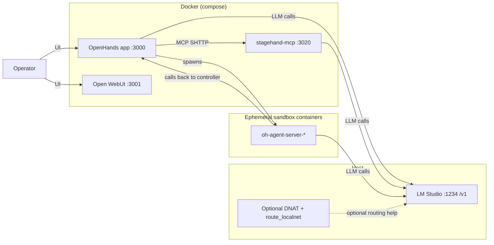
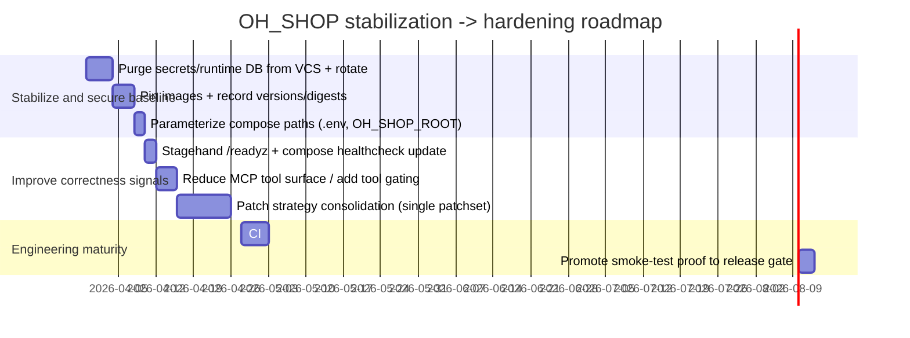

# Deep Research Report on Frankie02027/OH_SHOP

## Executive Summary

The **Frankie02027/OH_SHOP** repository is a **local-first, Docker-orchestrated “agent workstation” stack** that currently centers on **OpenHands (controller + UI)**, **Open WebUI (operator cockpit)**, and a **Stagehand-based browser/tool server exposed over MCP Streamable HTTP (SHTTP)**. A **host-installed LM Studio** provides the **OpenAI-compatible `/v1/*` API** that both OpenHands and Stagehand consume. fileciteturn88file0L1-L1 fileciteturn76file0L1-L1 citeturn0search5

The repo is explicit that it is **not yet “AI Garage”** (i.e., it does *not* implement higher-level orchestration concepts such as Alfred/Ledger/baton-passing) and that the immediate focus is **runtime stabilization—making the stack deterministic, honest, reproducible, and testable**. fileciteturn88file0L1-L1 fileciteturn89file0L1-L1

The most concrete, tested end-to-end proof path is implemented in `scripts/agent_house.py` and can now pass an automated browser-tool smoke test (navigate to `https://example.com` and capture a final assistant response). fileciteturn77file0L1-L1 fileciteturn95file0L1-L1

The biggest technical risks are **privilege and drift**: OpenHands mounts the **Docker socket** (host-level power by design), the OpenHands override image is built from a floating upstream `:latest`, Open WebUI uses a floating `:main`, and the repo currently includes **runtime state inside versioned source** (including files explicitly described as containing JWT/key material). fileciteturn76file0L1-L1 fileciteturn79file0L1-L1 fileciteturn93file0L1-L1

## Sources and method

This research started from the enabled connector **GitHub** (and used only the specified repository). External sources were consulted afterward for primary documentation on the underlying platforms and protocols.  

Enabled connector used: **github** (only).  

Primary repo artifacts examined (non-exhaustive): canonical compose definition, orchestration scripts, override Dockerfiles, runtime config/state files, runtime stabilization contracts and evidence, and the Stagehand MCP server implementation. fileciteturn76file0L1-L1 fileciteturn77file0L1-L1 fileciteturn79file0L1-L1 fileciteturn80file0L1-L1 fileciteturn83file0L1-L1 fileciteturn89file0L1-L1

External primary references used to validate platform behavior:
- OpenHands docs on Docker sandbox / configuration and REST endpoints. citeturn0search0turn0search2turn0search6turn0search3  
- LM Studio docs on OpenAI-compatible endpoints. citeturn0search5  
- Stagehand docs on MCP integrations (context for Stagehand’s MCP posture, though OH_SHOP’s MCP server is custom). citeturn0search4  

## Project purpose and scope

### What OH_SHOP is for today

The repository self-describes its current runtime as:
- Host **LM Studio** for the model provider  
- **OpenHands** as the controller/runtime UI  
- **Open WebUI** as a separate operator cockpit  
- **stagehand-mcp** as the active browser/tool lane  
- OpenHands-managed `oh-agent-server-*` sandbox containers as the execution boundary fileciteturn88file0L1-L1

This aligns with OpenHands’ documented architecture: OpenHands can run “sandboxes” (the execution environment) using a **Docker sandbox provider**, which runs the agent server in a Docker container and supports mounting host paths into the sandbox. citeturn0search0turn0search3

### What OH_SHOP is explicitly not (yet)

The repo repeatedly frames itself as **pre-“AI Garage”** and states that stabilization is meant to stop “multiple competing truths” (docs vs actual code paths vs persisted settings vs patch layers). It explicitly excludes implementing higher-level orchestration layers (Alfred, Ledger, baton-passing, memory) as “non-goals” for the stabilization phase. fileciteturn88file0L1-L1 fileciteturn89file0L1-L1

### Practical implications of this scope

The “product” right now is best understood as an **operator-controlled local agent stack**:
- There is no typical “application domain model” (like an ecommerce app would have). The core data model is operational: conversations, events, sandboxes, and configuration. fileciteturn78file0L1-L1 citeturn0search2  
- The repository is not structured like an SDK/library; it is structured like an **ops-and-runtime baseline** (compose + scripts + patches + docs). fileciteturn88file0L1-L1

## Current architecture and runtime workflow

### Component topology

At runtime, the canonical service set is defined by `compose/docker-compose.yml` and started via the wrappers `scripts/up.sh` → `scripts/agent_house.py up`. fileciteturn77file0L1-L1 fileciteturn76file0L1-L1

Core long-running services:
- `openhands` (container `openhands-app`)  
- `open-webui` (container `open-webui`)  
- `stagehand-mcp` (container `stagehand-mcp`) fileciteturn76file0L1-L1

The `chat-guard` service exists but is explicitly labeled “optional / provisional repair tooling,” and canonical startup does not include it. fileciteturn76file0L1-L1 fileciteturn77file0L1-L1

### Data flow and trust boundaries



Evidence for these edges:
- OpenHands is run via `uvicorn openhands.server.listen:app` in compose. fileciteturn76file0L1-L1  
- OpenHands uses Docker socket mounting to spawn sandboxes (agent-server containers). fileciteturn76file0L1-L1 citeturn0search0  
- OpenHands configuration points to `http://host.docker.internal:1234/v1` and an MCP SHTTP server at `http://host.docker.internal:3020/mcp`. fileciteturn84file0L1-L1  
- Stagehand MCP uses `/healthz` and `/mcp`, and is explicitly a streamable HTTP MCP transport server. fileciteturn83file0L1-L1  
- LM Studio exposes `/v1/models`, `/v1/chat/completions`, `/v1/responses`, etc., through its OpenAI compatibility layer. citeturn0search5  

### Runtime control plane

The repo’s **actual** control plane is `scripts/agent_house.py`:
- `up`: builds an overridden agent-server image and brings up core services via Docker Compose  
- `down`: `docker compose down` plus cleanup of `oh-agent-server-*` containers  
- `verify`: multi-layer verification (containers up, endpoints reachable, provider reachable from host and from containers, settings alignment)  
- `smoke-test-browser-tool`: creates an OpenHands conversation via API, waits for READY, observes tool events, and checks for final assistant reply capture fileciteturn77file0L1-L1

This emphasis on proof is consistent with OpenHands’ public guidance that the Web UI is backed by `/api/v1` endpoints, including conversation creation and sandbox resources. citeturn0search2turn0search6

## Codebase inventory and technical analysis

### Key files and directories

Canonical runtime files (as asserted by repo docs and implemented by scripts):
- `compose/docker-compose.yml` (authoritative service definition) fileciteturn76file0L1-L1  
- `scripts/agent_house.py` (authoritative orchestration and verification) fileciteturn77file0L1-L1  
- `compose/openhands_override/Dockerfile` (OpenHands app image patch layer) fileciteturn79file0L1-L1  
- `compose/agent_server_override/Dockerfile` (sandbox agent-server patch layer) fileciteturn80file0L1-L1  
- `repos/stagehand(working)/packages/mcp/src/server.ts` (custom Stagehand-based MCP server) fileciteturn83file0L1-L1  
- `data/openhands/settings.json` (persisted OpenHands runtime config) fileciteturn84file0L1-L1  
- Stabilization evidence set under `docs/runtime_stabilization/*` (contract, baseline snapshot, config authority, patch ledger, version authority, proof runs). fileciteturn89file0L1-L1 fileciteturn93file0L1-L1 fileciteturn90file0L1-L1 fileciteturn91file0L1-L1 fileciteturn92file0L1-L1 fileciteturn95file0L1-L1  

Non-authoritative / legacy / placeholder paths (repo calls these out explicitly):
- `compose/openhands.compose.yml` (deprecated subset) fileciteturn88file0L1-L1  
- `bridge/openapi_server/` (placeholder “Phase C”) (confidence: high; file itself states placeholder, but that file was not re-cited here)  
- `repos/OpenHands/` (present but declared non-authoritative and described as broken in version authority notes) fileciteturn88file0L1-L1 fileciteturn92file0L1-L1  

### Languages and frameworks

Observed primary implementation languages:
- **Python**: orchestration, patching, janitor tooling. fileciteturn77file0L1-L1 fileciteturn78file0L1-L1  
- **TypeScript/Node.js**: custom MCP server for Stagehand. fileciteturn83file0L1-L1  
- **YAML**: Docker Compose. fileciteturn76file0L1-L1  
- **Dockerfiles**: build-time patch layers and build reproducibility. fileciteturn79file0L1-L1 fileciteturn80file0L1-L1 fileciteturn81file0L1-L1  
- **Markdown**: operational contracts, evidence, audits. fileciteturn88file0L1-L1 fileciteturn89file0L1-L1  

Core frameworks/libraries:
- OpenHands runs as a Python web app served via `uvicorn`, with the repo using `/api/v1` endpoints to create and inspect conversations. fileciteturn76file0L1-L1 fileciteturn77file0L1-L1 citeturn0search2  
- Stagehand MCP server uses:
  - `@modelcontextprotocol/sdk` (MCP server + streamable HTTP transport)  
  - `@browserbasehq/stagehand` (browser automation agent framework)  
  - `playwright` (browser control)  
  - `zod` (schema validation)  
  - `@ai-sdk/openai-compatible` (OpenAI-compatible client; adapted for LM Studio quirks) fileciteturn82file0L1-L1 fileciteturn83file0L1-L1  

### Dependencies and versioning posture

Key dependency pinning (current repo posture):
- OpenHands app override is built from `docker.openhands.dev/openhands/openhands:latest` and then patched in-place. fileciteturn79file0L1-L1  
- Agent-server override is built from `ghcr.io/openhands/agent-server:61470a1-python` but then installs `openhands-agent-server==1.11.4`, `openhands-sdk==1.11.4`, `openhands-tools==1.11.4`. This creates a “version family skew” the repo itself calls out. fileciteturn80file0L1-L1 fileciteturn92file0L1-L1  
- Open WebUI uses `ghcr.io/open-webui/open-webui:main` (floating). fileciteturn76file0L1-L1  
- Stagehand MCP server depends on semver ranges like `^3.2.0` for Stagehand and `^1.27.1` for MCP SDK (not lockfile-pinned in the slice that is built). fileciteturn82file0L1-L1 fileciteturn81file0L1-L1  

External validation:
- OpenHands documents environment variables for selecting agent-server image repository/tag and for persistence directory. citeturn0search6  
- LM Studio documents OpenAI-compat endpoints such as `/v1/models`, `/v1/chat/completions`, `/v1/responses`. citeturn0search5  

### Build, test, deploy scripts

“Deploy” in this repo is local orchestration:
- `scripts/up.sh` / `scripts/down.sh` / `scripts/verify.sh` are thin wrappers around `agent_house.py`. fileciteturn77file0L1-L1  
- `agent_house.py up` explicitly builds the patched agent-server tag and then runs `docker compose up -d --build` for `openhands`, `open-webui`, `stagehand-mcp`. fileciteturn77file0L1-L1  
- A canonical proof harness exists: `agent_house.py smoke-test-browser-tool`, and there is an evidence-backed successful run recorded. fileciteturn77file0L1-L1 fileciteturn95file0L1-L1  

Testing approach present in-repo:
- “Verification” is implemented as layered runtime checks (container up, endpoint reachable, provider reachable from host & containers, settings alignment). fileciteturn77file0L1-L1  
- A smoke-test harness exercises tool invocation and reply capture. fileciteturn95file0L1-L1  
- A benchmark runner exists (`scripts/benchmark_runner.py`), but it is not obviously integrated into the stabilization contract’s canonical proof path (confidence: medium; it was not part of the stabilization evidence set captured here).  

### Data models and persistence

The primary persistence components are:
- `data/openhands/settings.json`: persisted configuration (model, base URL, MCP servers, etc.). fileciteturn84file0L1-L1  
- `data/openhands/openhands.db`: a SQLite state store with tables referenced by `chat_guard.py` (e.g., `conversation_metadata`, `app_conversation_start_task`, `event_callback`, `event_callback_result`). fileciteturn78file0L1-L1 fileciteturn93file0L1-L1  
- `data/openhands/v1_conversations/*`: event files (mentioned in baseline snapshot). fileciteturn93file0L1-L1  

This matches OpenHands’ documented model where *app conversations* and *sandboxes* are core resources exposed via `/api/v1`. citeturn0search2turn0search3

### API endpoints and tool contracts

OpenHands (publicly documented) V1 API includes key endpoints such as:
- `POST /api/v1/app-conversations`  
- `GET /api/v1/app-conversations`  
- sandbox search and lifecycle endpoints under `/api/v1/sandboxes/*` citeturn0search2  

The repo’s orchestration uses:
- `POST /api/v1/app-conversations` to start a run  
- `/api/v1/app-conversations/start-tasks?ids=...` to poll readiness  
- `/api/v1/app-conversations/search` and conversation event search endpoints to retrieve tool events and final output fileciteturn77file0L1-L1  

Stagehand MCP server:
- `GET /healthz` returns a simple JSON ok (no deep readiness). fileciteturn83file0L1-L1  
- `/mcp` is the MCP Streamable HTTP entry point, with sessions keyed by `mcp-session-id` header semantics. fileciteturn83file0L1-L1  

LM Studio:
- The repo expects `/v1/models` to be reachable at `http://host.docker.internal:1234/v1/models`. fileciteturn77file0L1-L1  
- LM Studio documents `/v1/models`, `/v1/chat/completions`, `/v1/responses`, etc. citeturn0search5  

## Risks, gaps, and improvement plan

### Security issues and operational hazards

High-impact, repo-evidenced risks:

1. **Docker socket mount grants extremely high privilege to OpenHands**  
OpenHands mounts `/var/run/docker.sock`, which allows it to create/stop containers (required to spawn sandboxes but a major trust boundary). fileciteturn76file0L1-L1 citeturn0search0

2. **Versioned runtime state appears to include sensitive material**  
The baseline snapshot explicitly lists `data/openhands/.jwt_secret` and `data/openhands/.keys` under runtime state and reports them as tracked in git at that time. Even if this has since changed, the repo history and current posture should be treated as compromised until verified/rotated. fileciteturn93file0L1-L1

3. **Host networking mutation via DNAT helper**  
`scripts/lmstudio-docker-dnat.sh` enables `route_localnet` and installs an iptables DNAT rule for `172.16.0.0/12:1234 → 127.0.0.1:1234`. This is powerful and system-wide; it must be treated as privileged ops configuration with rollback/guardrails. fileciteturn87file0L1-L1

4. **Policy/behavior overlay file can silently push “autonomous/no-confirmation” behavior**  
`repos/.openhands_instructions` is written as an instruction contract emphasizing fully autonomous operation and extensive file authority. Whether OpenHands actively ingests this file automatically depends on OpenHands behavior and mount points, but its presence is a governance risk and is already stale (it references a tool that is not current). fileciteturn86file0L1-L1 fileciteturn88file0L1-L1

5. **Floating upstream images + brittle string patching = drift risk**  
The OpenHands override image builds from upstream `:latest` and applies string-based patching that can break when upstream code changes. Open WebUI uses `:main`. The repo itself identifies “floating upstream mutation” as a top risk. fileciteturn79file0L1-L1 fileciteturn76file0L1-L1 fileciteturn89file0L1-L1

### Licensing and compliance risks

**No explicit top-level license was identified during this inspection** (confidence: medium-high; targeted checks were not fully enumerated in the evidence set here). Given that the repo includes vendored upstream projects and uses container images from third parties, you should assume licensing obligations exist and must be made explicit. fileciteturn92file0L1-L1

### Missing or inconsistent documentation

Strengths: the repo has unusually detailed stabilization artifacts (contract, baseline snapshot, patch ledger, version authority, proof spec, proof rerun results). fileciteturn89file0L1-L1 fileciteturn93file0L1-L1 fileciteturn91file0L1-L1 fileciteturn95file0L1-L1

Gaps that still matter operationally:
- The repo is highly **host-path specific** (`/home/dev/OH_SHOP` hard-coded in compose), limiting portability and making “works on my machine” the default mode. fileciteturn76file0L1-L1  
- “Health” is still **weak readiness** for Stagehand MCP: `/healthz` does not verify Chromium launch or LLM availability. fileciteturn83file0L1-L1  
- Config authority documents contain a time-local contradiction: the config authority artifact states the final reply capture issue remained, while the later proof rerun artifact demonstrates success (meaning documentation needs a “latest status” reconcile). fileciteturn90file0L1-L1 fileciteturn95file0L1-L1  

### Repo-to-best-practices comparison table

| Area | Current repo pattern (evidence) | Industry best-practice baseline | Recommended change |
|---|---|---|---|
| Image pinning | `docker.openhands.dev/openhands/openhands:latest`, `ghcr.io/open-webui/open-webui:main` fileciteturn79file0L1-L1 fileciteturn76file0L1-L1 | Pin versions/digests for deterministic rebuilds | Pin OpenHands/OpenWebUI to immutable tags or digests; record in a lockfile or “versions” doc |
| Patch strategy | String patches in Dockerfile against upstream internals fileciteturn79file0L1-L1 | Prefer maintained forks or patch files applied with clear version gates | Convert to: (a) pinned upstream version + (b) patchset applied via `git apply` with checksums |
| Runtime state in repo | Runtime state directory includes DB and key material (baseline snapshot) fileciteturn93file0L1-L1 | Keep secrets/state out of VCS; provide templates and migration scripts | Remove sensitive/runtime DB from VCS, rotate secrets, commit only templates and schema notes |
| Least privilege | Docker socket mount; broad tool server capabilities fileciteturn76file0L1-L1 fileciteturn83file0L1-L1 | Reduce privilege where possible; add “dangerous ops” gates | Add docker-socket proxy, restrict MCP tool list via env flags, audit exposed endpoints |
| Health/readiness | Stagehand `/healthz` is shallow fileciteturn83file0L1-L1 | Readiness should validate downstream deps | Add `/readyz` that checks LM Studio `/v1/models` + Chromium launch + Stagehand init |
| Config portability | Absolute host paths in mounts fileciteturn76file0L1-L1 | Parameterize via `.env` and relative paths | Introduce `OH_SHOP_ROOT` and use `${OH_SHOP_ROOT}`-based mounts; ship `.env.example` |
| CI/CD | No root-level CI workflow observed; only vendored repos have CI fileciteturn91file0L1-L1 | CI for lint/build/smoke is standard | Add CI: lint Python, typecheck TS, `docker compose config`, minimal build checks |
| Proof discipline | Canonical proof defined and rerun artifacts captured fileciteturn94file0L1-L1 fileciteturn95file0L1-L1 | Keep “golden path” tests; automate where possible | Promote smoke-test to mandatory “release gate”; store proof outputs in artifacts with timestamps |

### Prioritized actionable improvements

Effort sizing: **Small** (≤1 day), **Medium** (1–5 days), **Large** (≥1–2 weeks). Risk reflects likelihood of breaking the working baseline.

**Immediate (highest urgency)**

1. **Purge secrets/runtime DB from version control; rotate key material**  
Evidence indicates `.jwt_secret` and `.keys` were tracked and are runtime-significant. Treat as compromised until rotated.  
Effort: **Medium** (because history rewrite + rotation)  
Risk: **Medium** (operational disruption if rotation mishandled) fileciteturn93file0L1-L1

2. **Pin upstream images (stop floating `:latest` / `:main`)**  
This is the single biggest reproducibility and “silent breakage” risk, and it’s explicitly called out by the repo’s own stabilization contract.  
Effort: **Small–Medium** (choose versions, validate patches still apply)  
Risk: **Medium** (patches may fail against pinned version, but that’s the point: fail deterministically) fileciteturn79file0L1-L1 fileciteturn89file0L1-L1

3. **Harden Stagehand MCP readiness**  
Right now `/healthz` does not prove “browser + provider usable.” Implement `/readyz` and switch compose healthcheck to it.  
Effort: **Small**  
Risk: **Low–Medium** (might mark service unhealthy until deps are ready; that’s desirable) fileciteturn83file0L1-L1 fileciteturn76file0L1-L1

**Next (stability and maintainability)**

4. **Remove hard-coded `/home/dev/OH_SHOP` paths; parameterize with `.env`**  
Improves portability and reduces “host identity” coupling.  
Effort: **Small**  
Risk: **Low** (mostly compose refactor) fileciteturn76file0L1-L1

5. **Consolidate patch layers into a single, version-gated patchset**  
Current patch ledger shows duplicated converter overrides and mixed strategies; unify into one patch application mechanism and remove superseded scripts after quarantine.  
Effort: **Medium–Large**  
Risk: **High** (touches the fragile layer that makes tool-calling work) fileciteturn91file0L1-L1

6. **Reduce MCP tool surface or gate “dangerous” tools behind an env flag**  
The Stagehand MCP server currently exposes cookie management, arbitrary JS evaluation, connect URLs, and more. That’s powerful; gate it.  
Effort: **Medium**  
Risk: **Medium** (could break workflows relying on these tools, but likely improves safety posture) fileciteturn83file0L1-L1

**Later (engineering maturity)**

7. **Add root-level CI that proves the baseline stays buildable**  
At minimum: Python lint, TypeScript build, `docker compose config`, and a “mocked” smoke harness unit test for parsing.  
Effort: **Medium**  
Risk: **Low** (CI doesn’t affect runtime unless enforced) fileciteturn77file0L1-L1 fileciteturn82file0L1-L1

8. **Turn the smoke-test proof into a repeatable “release gate”**  
The proof rerun artifact is strong evidence; formalize it: store output as a build artifact and require it for version bumps.  
Effort: **Small–Medium**  
Risk: **Low** fileciteturn95file0L1-L1

### Critical code snippets / diffs for high-leverage fixes

#### Diff: make runtime state non-versioned and fix `.gitignore` errors

Problem: `.gitignore` does not ignore `data/`, and also appears to have a typo for `stagehand(working)` path. fileciteturn85file0L1-L1

Proposed patch:

```diff
diff --git a/.gitignore b/.gitignore
index c5b24c5..deadbeef 100644
--- a/.gitignore
+++ b/.gitignore
@@ -1,3 +1,21 @@
+# -----------------------------------------------------------------------------
+# OH_SHOP: keep secrets + mutable runtime state OUT of version control
+# -----------------------------------------------------------------------------
+data/openhands/.jwt_secret
+data/openhands/.keys
+data/openhands/openhands.db
+data/openhands/v1_conversations/
+downloads/
+artifacts/backups/
+
+# Optional: ignore all OpenHands state by default, keep only templates/docs
+# data/openhands/*
+# !data/openhands/settings.template.json
+# !data/openhands/README.md
+
 .vscode/
 **/__pycache__/
 **/*.py[cod]
@@ -15,10 +33,10 @@ nohup.out
 # Local runtime state
 .openhands/
 
-
 # Nested repos managed separately
-repos/stagehands(working)/node_modules/
-repos/stagehands(working)/.turbo/
-repos/stagehands(working)/.vscode/
-repos/stagehands(working)/.venv/
-repos/stagehands(working)/__pycache__/
+repos/stagehand(working)/node_modules/
+repos/stagehand(working)/.turbo/
+repos/stagehand(working)/.vscode/
+repos/stagehand(working)/.venv/
+repos/stagehand(working)/__pycache__/
```

Follow-on (non-diff) requirement: rotate/recreate JWT and key materials and treat history as compromised if those were ever pushed to a remote. This is consistent with the repo’s own baseline snapshot warning about tracked key material. fileciteturn93file0L1-L1

#### Diff: add Stagehand readiness and improve the meaning of health checks

Problem: `/healthz` only returns `{status:"ok"}` regardless of Chromium/LM Studio readiness. fileciteturn83file0L1-L1

Proposed patch sketch:

```diff
diff --git a/repos/stagehand(working)/packages/mcp/src/server.ts b/repos/stagehand(working)/packages/mcp/src/server.ts
index 82aa794..cafebabe 100644
--- a/repos/stagehand(working)/packages/mcp/src/server.ts
+++ b/repos/stagehand(working)/packages/mcp/src/server.ts
@@
 const httpServer = http.createServer(async (req, res) => {
@@
   // Health endpoint
   if (url.pathname === "/healthz") {
     res.writeHead(200, { "Content-Type": "application/json" });
     res.end(JSON.stringify({ status: "ok", timestamp: new Date().toISOString() }));
     return;
   }
+
+  // Readiness endpoint: proves downstream dependencies
+  if (url.pathname === "/readyz") {
+    try {
+      // 1) LM Studio reachable
+      const modelsUrl = `${BASE_URL.replace(/\/$/, "")}/models`;
+      const r = await fetch(modelsUrl, { method: "GET" });
+      if (!r.ok) throw new Error(`LLM not ready: HTTP ${r.status}`);
+
+      // 2) Chromium exists (basic check; deeper check can attempt launch)
+      if (!CHROME || CHROME.trim().length === 0) throw new Error("CHROME_PATH unset");
+
+      // 3) Stagehand can initialize (optional: cached init)
+      // NOTE: do NOT always init here if you want fast readiness.
+      // If you do, cache stagehand instance as the main code already does.
+      await getStagehand();
+
+      res.writeHead(200, { "Content-Type": "application/json" });
+      res.end(JSON.stringify({ ready: true, timestamp: new Date().toISOString() }));
+    } catch (e) {
+      const msg = e instanceof Error ? e.message : String(e);
+      res.writeHead(503, { "Content-Type": "application/json" });
+      res.end(JSON.stringify({ ready: false, error: msg }));
+    }
+    return;
+  }
```

Then update compose healthcheck to hit `/readyz` instead of `/healthz`. This change directly supports the repo’s own rule that health endpoints are “weak readiness only” unless they validate real invariants. fileciteturn77file0L1-L1 fileciteturn89file0L1-L1

### Suggested roadmap

Dates are illustrative and assume you want to maintain the current working baseline while improving determinism and security.



Key deliverables per milestone are already aligned with the repo’s stabilization contract language: “one startup path, one config truth, one patch truth, one browser lane, one version family, one proof path.” fileciteturn89file0L1-L1

### Risk/impact matrix

| Risk | Evidence | Likelihood | Impact | Notes / mitigation |
|---|---|---|---|---|
| Secrets in repo history | Baseline snapshot describes `.jwt_secret` / `.keys` tracked fileciteturn93file0L1-L1 | High | High | Treat as compromised; rotate; rewrite history |
| Upstream drift breaks patches | OpenHands override builds from `:latest` and patches internals fileciteturn79file0L1-L1 | High | High | Pin versions/digests; version-gate patchset |
| Docker socket privilege | Compose mounts docker.sock fileciteturn76file0L1-L1 | Medium | High | Document threat model; consider socket proxy or dedicated daemon context |
| Weak health signals | Stagehand `/healthz` shallow fileciteturn83file0L1-L1 | Medium | Medium | Add `/readyz` with real dependency checks |
| Config drift between persisted settings vs “expected” values | Repo has explicit config authority and drift reconciliation problems fileciteturn90file0L1-L1 | Medium | Medium | Keep current runtime docs aligned and assert via verify |
| Tool surface too broad | Stagehand MCP exposes cookies/eval/connect URL fileciteturn83file0L1-L1 | Medium | Medium–High | Gate or remove high-risk tools; default-deny |

### “Smarter way” to keep this project sane long-term

If you do only one architectural meta-change: **stop patching floating images** and move toward a **“pinned base + patchset”** posture. The repo already contains the intellectual scaffolding (patch ledger, version authority, proof spec); the missing part is making the build deterministically replayable. fileciteturn91file0L1-L1 fileciteturn92file0L1-L1 fileciteturn95file0L1-L1